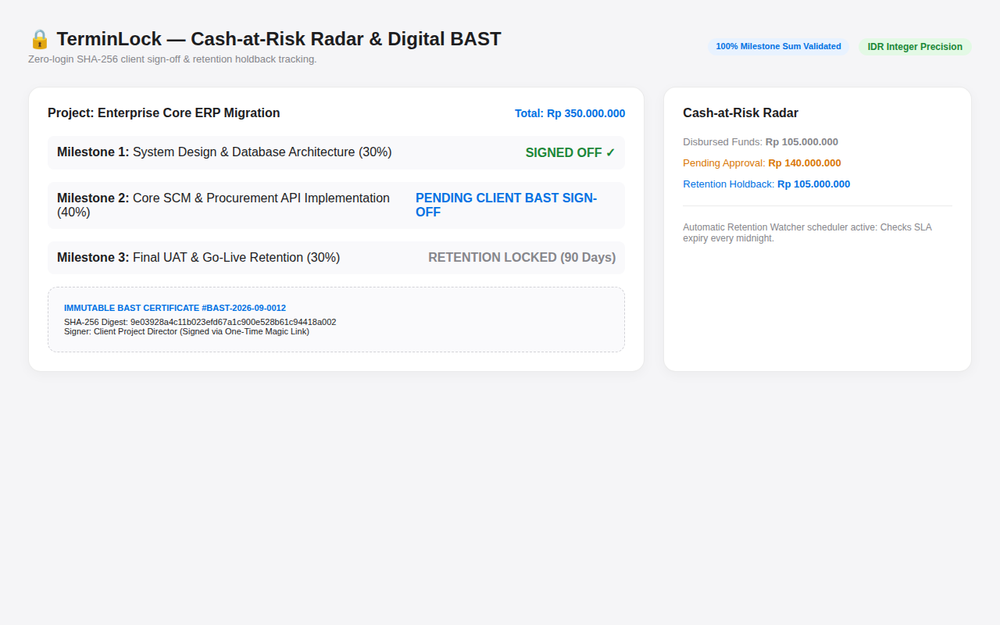
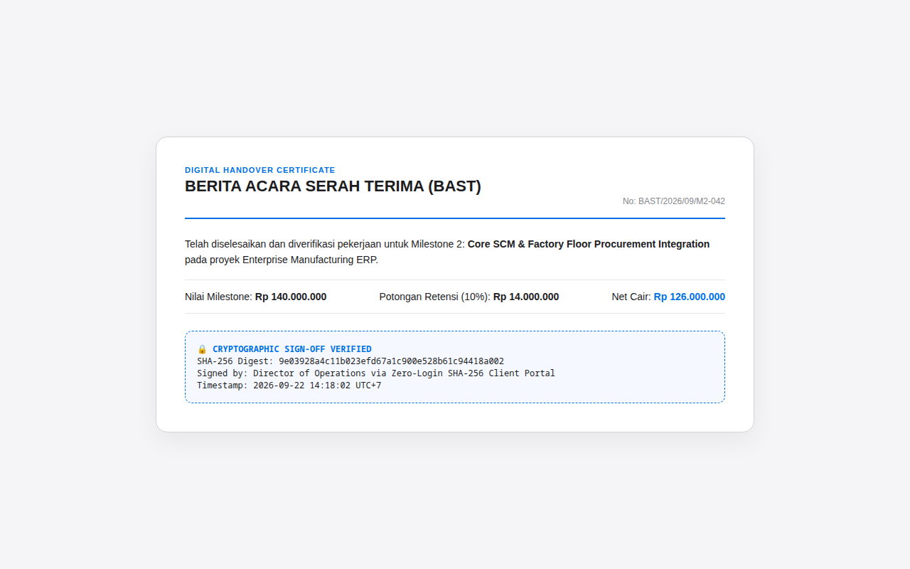

# 🛡️ TerminLock — Milestone Billing, Digital BAST Sign-Off & Retention Watcher

> **Enterprise contractor billing governance platform ensuring 100% milestone financial reconciliation, zero-login SHA-256 client sign-offs, and automated retention release watchdogs.**

---

## 📸 Visual Showcase & Financial Governance

<p align="center">
  
</p>
<p align="center"><em>Figure 1: Cash-at-Risk Financial Radar displaying milestone completion timelines, overdue invoices, and retention holdbacks.</em></p>

<br />

<div align="center">
  <table width="100%">
    <tr>
      <td width="100%" align="center">
        
        <br /><strong>Figure 2: Tamper-Proof Cryptographic BAST Certificate</strong><br />
        <em>Immutable SHA-256 digital handover certificate signed via the zero-login client approval portal.</em>
      </td>
    </tr>
  </table>
</div>

---

## 💼 Business Logic & Engineering Defenses

- **Exact Integer Money Storage:** All IDR values are stored as 64-bit integers (`BIGINT`) down to the exact Rupiah, eliminating IEEE-754 floating-point rounding errors.
- **100% Milestone Sum Invariant:** Contract milestone allocations are strictly validated to sum up to exactly 100% of the contract value before activation.
- **Zero-Login SHA-256 Client Sign-Off:** Clients receive a cryptographically signed one-time link to inspect deliverables, approve work, and generate an immutable BAST certificate.
- **Retention Holdback Watcher:** Automated cron scheduler monitoring the 3-6 month defect liability period and alerting finance teams when retention funds mature.

---

## 🧪 Verification & Acceptance

- **PHPUnit Tests:** 16 feature tests verifying integer money math, milestone invariants, and sign-off workflows.
- **Playwright E2E:** 2 full end-to-end client handover journeys passed.
- **Spec Drift Gate:** 12/12 acceptance checks verified.

---

## 🚀 Quickstart

```bash
git clone https://github.com/Samidkun/terminlock.git
cd terminlock

composer install
pnpm install
cp .env.example .env
php artisan key:generate
php artisan migrate --seed
./scripts/local-ci.sh
```
