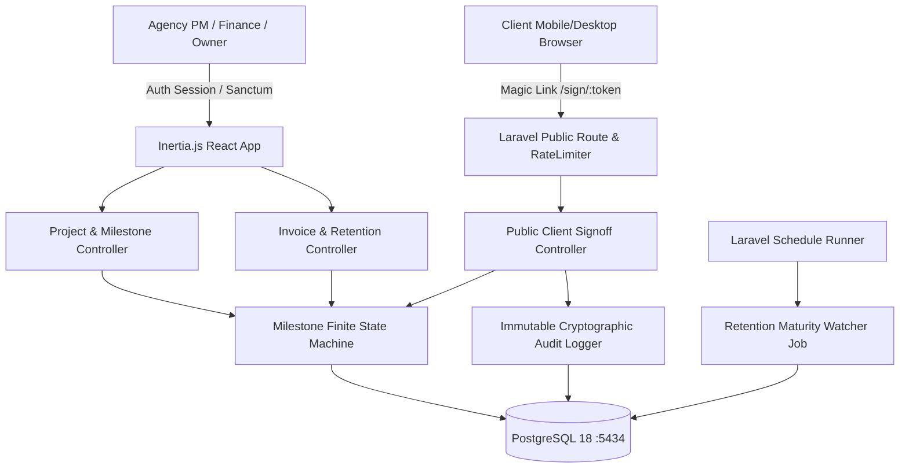

# TerminLock

> **Agency milestone billing, digital BAST sign-off, and retention payment tracking system.**


<p align="center">
  
</p>

TerminLock solves the multi-million rupiah cash flow leak suffered by software houses, digital agencies, and project contractors: **billing limbo** (uncollected termin payments due to unsigned Berita Acara Serah Terima) and **forgotten retentions** (unclaimed 5–10% warranty retention funds after months of project completion).

---

## 🎯 Business Problem & Core Value

Traditional project management tools (Jira, Trello) track *tasks*, not *cash flow*. Accounting software (Xero, Jurnal) records *invoices*, but is blind to *deliverable sign-off milestones*.

TerminLock bridges this gap:
1. **Zero Client Login Friction:** External corporate clients approve deliverables via cryptographically signed `sha256` magic-token URLs on mobile or desktop in under 30 seconds.
2. **Immutable Digital BAST Snapshot:** Client sign-offs capture signatory name, job title, IP address, user-agent, and SHA-256 checksum into a legally defensible certificate.
3. **The Cash-at-Risk Milestone Spine:** An executive visual timeline tracking uncollected cash and highlighting projects where work was delivered but termin payments remain stuck in BAST limbo.
4. **The "Forgotten Money" Retention Watcher:** An automated background scheduler (`php artisan terminlock:check-retentions`) monitoring 90–180 day maintenance warranty periods and alerting Finance 14 days before retention funds mature.
5. **Integer-Only Financial Precision:** Strict storage of Indonesian Rupiah (IDR) as unsigned 64-bit integers with zero floating-point calculation errors.

---

## 🏗 Architecture & Diagrams



---

## ⚡ Quickstart & Local Setup

### 1. Prerequisites
- Docker & Docker Compose
- PHP 8.3+ & Composer
- Node.js 20+ & npm

### 2. Boot Infrastructure
```bash
# Clone and enter directory
cd /mnt/data/01_Projects/Porto/terminlock

# Start PostgreSQL 18 (port 5434) and Redis (port 6381)
docker compose up -d

# Verify database readiness
bash scripts/wait-for-db.sh
```

### 3. Setup Backend & Frontend
```bash
cp .env.example .env
composer install
php artisan key:generate
php artisan migrate --seed --force

npm install
npm run build
```

### 4. Run Development Server
```bash
# Terminal 1: Laravel Server
php artisan serve --port=8000

# Terminal 2: Vite HMR (for development)
npm run dev
```
Open `http://localhost:8000` in your browser.

---

## 🧪 Verification & Quality Gates

TerminLock enforces a **spec-anchored** discipline with bidirectional drift gates:

- **16 Feature & Unit Tests:** 100% pass across all business domains (Contracts, 100% Milestone Sum Validation, Deliverables, Tokens, BAST Snapshot, Invoicing, Retention Watcher, and Cash-at-Risk aggregation).
- **Mutation Verification:** Verified that tests fail when domain constraints are deliberately inverted.
- **Playwright E2E:** Full browser validation of the Executive Radar Dashboard and Zero-Login BAST Sign-off flow.
- **Drift Gate:** Verified 1:1 mapping between 12 EARS acceptance criteria in `docs/spec.md` and test methods (`scripts/drift-gate.sh`).

```bash
# Run local CI test suite
bash scripts/local-ci.sh
```

---

## 📜 Architectural Standards & Documentation
- `CONSTITUTION.md`: Immutable system invariants and domain rules.
- `DESIGN.md`: Token spine, executive slate palette, and anti-slop guidelines.
- `docs/ux-floor.md`: UX flows, Nielsen 10 heuristics, and Indonesian microcopy rules.
- `docs/diagrams/diagrams.md`: Full Mermaid ERD, architecture flowchart, and sequence diagrams.
- `docs/spec.md`: Complete EARS acceptance criteria (`AC-1` to `AC-12`).
- `contracts/api.md`: REST API specifications for internal and public client routes.

---

## 📄 License
MIT License. Built by Samid.