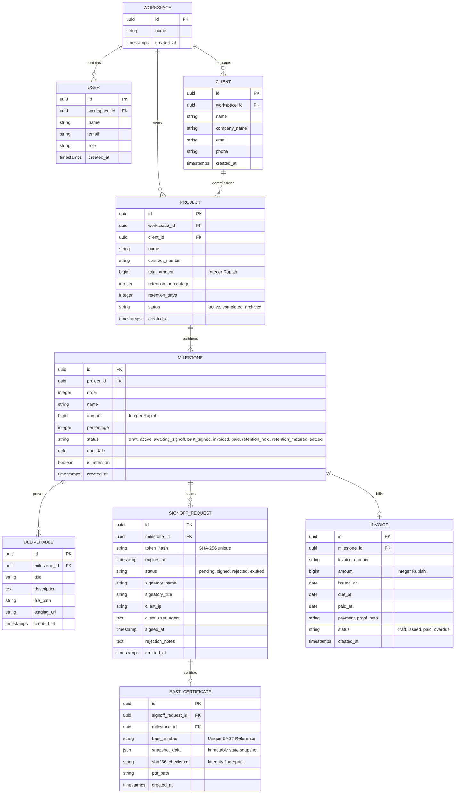
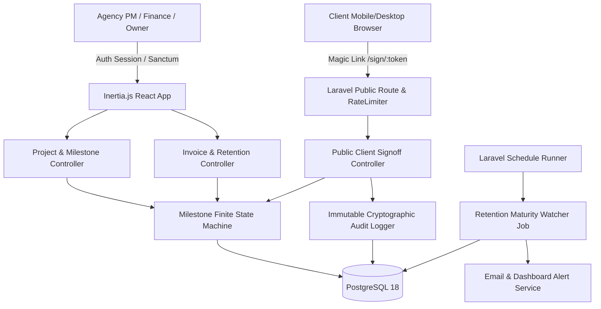
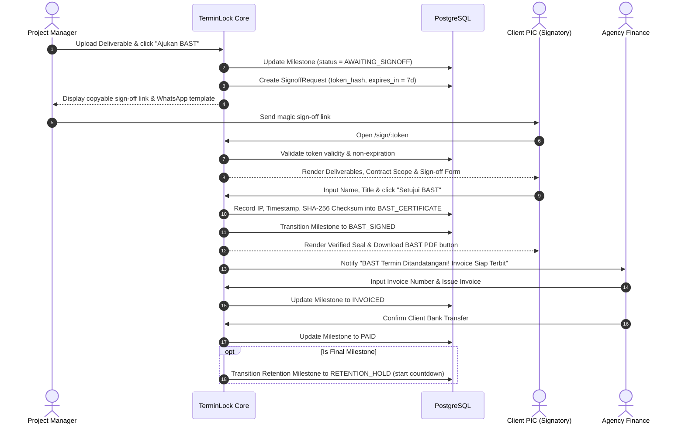

# TerminLock Diagrams as Code (`docs/diagrams/diagrams.md`)

## 1. Entity Relationship Diagram (Mermaid ERD)

---

## 2. High-Level Architecture Diagram

---

## 3. Sequence Diagram: BAST Digital Sign-off & Billing Transition

